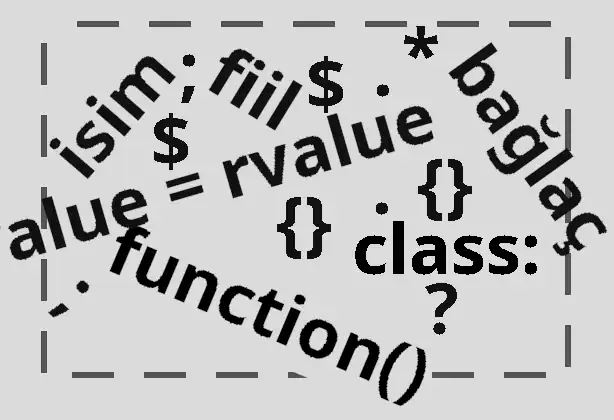
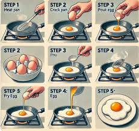
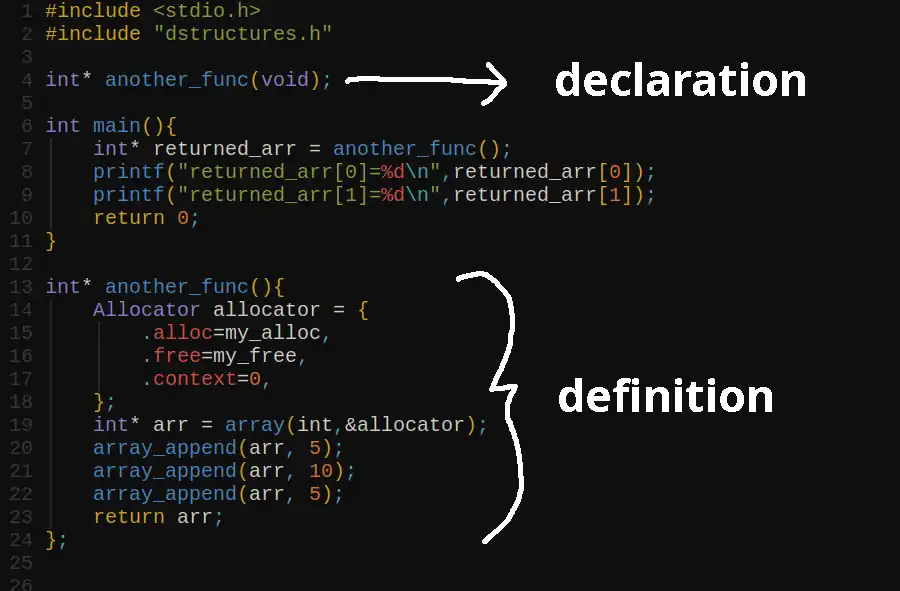
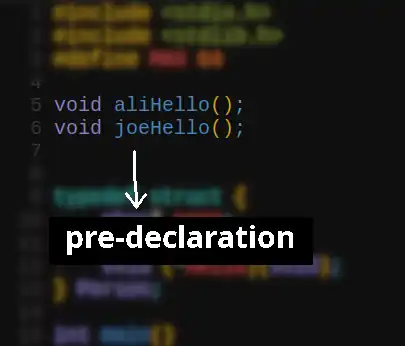
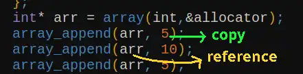
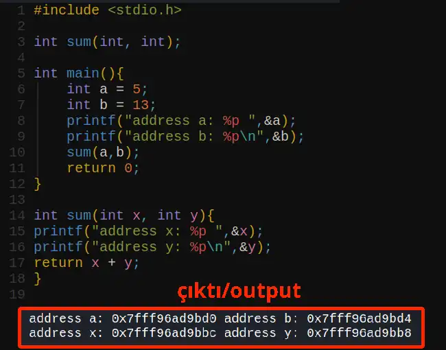
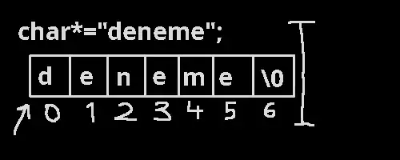
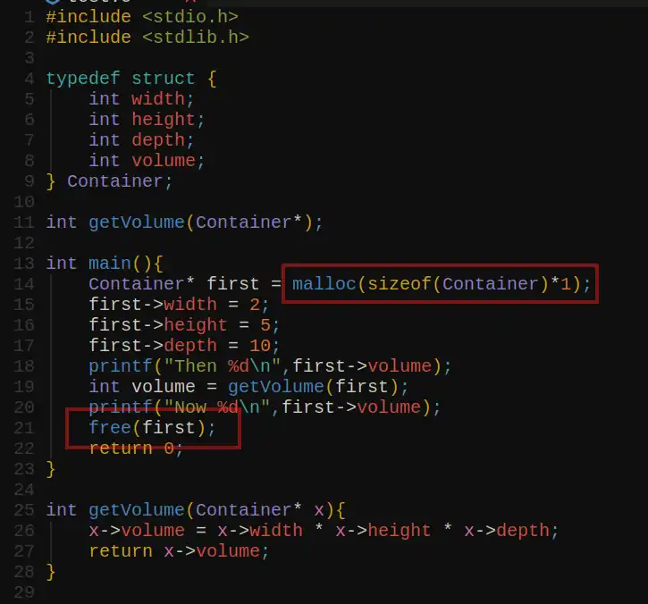

# Unterschiedung zwischen syntax und semantik

## Syntax

Regeln von Sprache, wie Programme geschrieben werden. Bezieht sicht auf die Struktur und Anordnung der Sprache.
Fehler werden beim Compilezeit gefunden.



## Semantik

Bezieht sich darauf, was der Code tatsächlich bewirken soll.
Semantische Fehler (z. B. falsche Berechnungen oder nicht erreichte Programmziele.
Fehler werden bei der Ausführung gefunden.



<hr>

# Dekaration und Definition

## Deklaration

Mit der Deklaration wird dem Programm die Eigenschaften vom Bezeichner klargemacht.
Hier wird eine Funktion deklariert aber nicht definiert.

## Definition

Mit der Definition wird der Bezeichner erklärt, was er machen wird (für Funktionen). Bei Variablen aber declaration und definition findet gleichzeitig statt.

<br>



<hr>

# Funktionen

## Funktion Deklaration

```c
int someFunc(float,double,_Bool);
```

```c
type name(type parameter);
```

Deklaration kann mehrmals vorhanden sein.

## Funktion Definition

```c
int someFunc(float x, double y, _Bool isTrue){
printf("do some stuffs\n");
}
```

```c
type name(type parameter){
    statements();
}
```

Definition sollte einmal gegeben werden.

## Vordeklaration

Programm wird sequentiell von oben nach unten ausgeführt.
Funktionen, Variablen odere andere Sachen müssen vorerst zum Beginn deklariert werden.



## Funktionen mit Parametern aufrufen

Man gibt die Parameter in die Funktion innerhalb Klammern. Bei der Parametern muss man darauf achten, auf was man machen will. Z.B. wenn man die eigentliche Parametereigenschaften ändern möchte, sollte man daher Referenz geben. Wenn es aber um keine größe Memory handelt und man echte Parameter nicht ändern möchte, ruft man Funktionen mit Parameterwerten.
Daher handelt es sich dabei um den Speicher also die Differenzierung zwischen Stack und Heap.



### Call by value

Kopie des Wertes wird in die Funktion gegeben, der im Stack gespeichert wird.
Man ist nicht verantwortlich für das Löschen vom Speicher. Werte werden automatisch im Stack von Funktion am Ende gelöscht.



### Call by reference

Man gibt den Speicheraddress in die Funktion.
In funktion wird die gleiche Address von Parameter gehandelt.


<hr>

## Pointers

Pointer enthalten die Speicheradresse, der Datentyp vor Pointer zeigt auf Datentyp des Wertes auf. Wenn man den Datentyp nicht weiß, der auf Werteadresse zeigt, benutzt man void Pointer (void*). Man erreicht den Wert des Pointers via Dereferenzierung.
Meine Erfahrungen nach benötigen und benutzen wir Pointer meistens für aneinandergebundene Werte, z.B. bei Strings (char*) benutzen wir eigentlich Pointer, die auf Anfang des Strings zeigt. Mit Pointerarithmetik erreicht man damit einzelne Werte von Strings wie string[1], string[n] etc.



Da sagt man, dass * (asterisk) zu Dereferenzierung genutzt wird aber tatsächlich nutzt man nicht nur das zur Dereferenzierung.

### Dereferenzierung Beispiel:

```
x.wert
x->wert
x[3]
printf("%s",x);
*&x.wert
```

Mit diesen kann man auch die Werte bekommen, als ob x Pointer ist.

### Array von integers.

```
int arr[10];
```

### Array von Pointers von integers. 

```
int* arr[10];
```

### Array von Pointers von structures.

```
Person* students[20];
```


#### Call by Reference und Pointer Beispiel:


