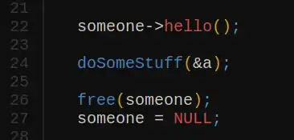
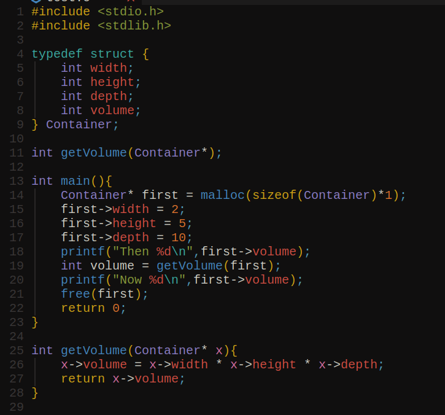

# Syntax ve Semantik farkı
## Syntax
Programlama dilinin kuralları, nasıl yazıldığı. Dilin genel yapısını kuralını ifade eder.
Hatalar derleme (compile) esnasında bulunabilir çünkü bu kurallar bellidir ve kontrol edilir.


## Semantik
Kodun nasıl çalışacağını ve anlamını ifade eder.
Semantik hatalar (mesela hatalı hesaplamalar veya ulaşılamayan kod blokları)
Hatalar çalıştırma esnasında bulunur.


<hr>
# Dekaration und Definition
## Deklaration
Deklarasyon ile değişkenlerin özellikleri, yapıları programa verilir.
Mesela burada bir fonksiyon deklare ediliyor ama tanımlanmıyor (definition).
```
int getVolume(int, int, int);
```
## Definition
Tanımlama ile programa bu değişkenin, fonksiyonun, yapının ne yapacağı nasıl yapacağı anlatılır.
Değişkenlerde çoğunlukla Declaration ve Definition aynı anda olur.
Mesela burada aynı anda değişken deklare edilir ve tanımlanır:
```
int x = 10;
```
<br>

<hr>
# Funktionen

## Funktion Deklaration
```c
int someFunc(float,double,_Bool);
```
Deklarasyon birçok defa yapılabilir
## Funktion Definition
```c
int someFunc(float x, double y, _Bool isTrue){
printf("do some stuffs\n");
}
```
Tanımlama sadece bir defa yapılır.

## Vordeklaration
Program yukarıdan aşağıya doğru çalıştırılır.
Fonksiyonlar, değişkenler ya da başka şeyler en başta deklare edilmelidir.


## Funktionen mit Parametern aufrufen
Bir fonksiyona parametreleri parantez içine yazarak veririz. Parametrelerde asıl parametreyi değiştirip isteyip istemediğinize ve extra memory'nin sizin için sorun olup olmayacağına. Buna göre iki olay vardır: Call by value ve Call by reference. Burada stack ve heap ayrımı yapılır.
Stack kısa sürelidir LIFO'dur ve hızlıdır. Heap dynamic memory allocation'da kullanılır ve elle geri alan açmak gerekir.


### Call by value
Parametrenin kopyası fonksiyona verilir, fonksiyonun kendi hafızasında (stack) tutulur, iş bittikten sonra otomatik silinir.
Manuel hafıza yönetimi gerekmez.


### Call by reference
Bellek referansı verilir, asıl değer dereferans ile görülebilir veya değiştirilebilir. Bellek az tutar çünkü sadece bir kere oluşturulur ve fonksiyona ise referansı verilir.



<hr>

## Pointers
İşaretiçiler * (asterisk) işareti ile ifade edilir.
İşaretçiler bellek adreslerini tutarlar, işaretçinin veri türü işaret ettiği adreste yer alan veri türüne göre verilmelidir. Eğer veri türünü bilmiyorsak veya henüz belli değilse void kullanılır.
Değere dereferans işareti ile ulaşılır * (Asterisk)
Bana göre işaretçiler çoğunlukla arka arkaya koyulan verilerde kullanılır. Mesela Stringlerde (char*) aslında pointer kullanırız çünkü her bir bellek adresi ayrı harfi tutar ve bu pointer cümlenin ilk başının adresine işaret eder &string[0].
Pointer aritmetiği ile de değerler ulaşılınır. mesela string* için: string + 1 = string[1]
Bir sonraki adrese işaret eder.


Dereferans için sadece asterisk kullanmak gerekmez.

Dereferans örnekleri
```
x.wert //değerler için
x->wert //işaretçiler için
x[3]
printf("%s",x);
```

####Call by Reference und Pointer Beispiel:



### integer array.
```
int arr[10];
```

### integerlardan oluşan pointer array. 
```
int* arr[10];
```

### structurlardan oluşuan pointer array.
```
Person* students[20];
```


#### Call by Reference ve Pointer örneği:


